<!DOCTYPE html>

<html>
<head>
    <h1 align="center">Defense Strategies</h1>
</head>
<!---------------------------------------------------------------------------->
    <body>
 
        <figure>
            

                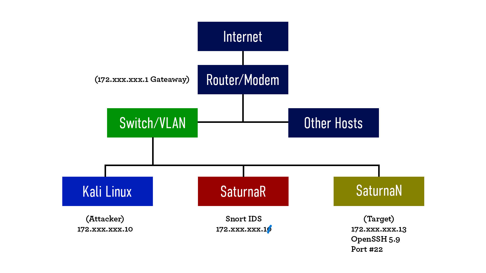
            

        </figure>
        <section>
            <h1 align="center">PART 1 - The Generic Attack Scenario</h1>
            

                The following graphical sketch illustrates a generic attack scenario associated with the selected vulnerability. The vulnerability affects the host <strong>SaturnaN (172.xxx.xxx.13)</strong>, which is running <strong>OpenSSH 7.2p2 Ubuntu 4ubuntu2.1 (protocol 2.0)</strong> and provides SSH services through port 22. Because the SSH service is publicly accessible, attackers may attempt to identify known weaknesses, gather information about the system, and exploit vulnerabilities to gain unauthorized access or compromise the host.
            

            

                In this attack scenario, we first performed reconnaissance to identify active hosts and discover open ports on the network. Using <strong>Nmap</strong>, we found that SaturnaN had <strong>port #22</strong> open and was running an SSH service on an outdated Ubuntu operating system. An attacker could use this information to search for known vulnerabilities affecting the unsupported operating system or its services and attempt to exploit them to gain unauthorized access. If successful, the attacker could potentially access sensitive information, execute unauthorized commands, or use the compromised host as a starting point for further attacks within the network.
            

            

                To reduce this risk, the operating system should be upgraded to a supported version of Ubuntu that still receives security updates. In addition, <strong>Snort IDS/IPS</strong> can be used to monitor network traffic and generate alerts when suspicious SSH activity is detected. <strong>IPTables</strong> can also help by filtering incoming connections and blocking unauthorized access attempts, reducing the exposure of the SSH service.
            

        </section>
<!---------------------------------------------------------------------------->
        <section>
            <h1 align="center">PART 2 - Metasploit and Wireshark</h1>
            

                We then tested the OpenSSH service using a username enumeration exploit. The vulnerability allows us to discover valid usernames on the target system, which could assist in future authentication attacks. Wireshark was used to capture the network traffic just before and after running the exploit in order to observe the changes in SSH communication and the packets generated during the enumeration process.
        

 
        <figure>
            

                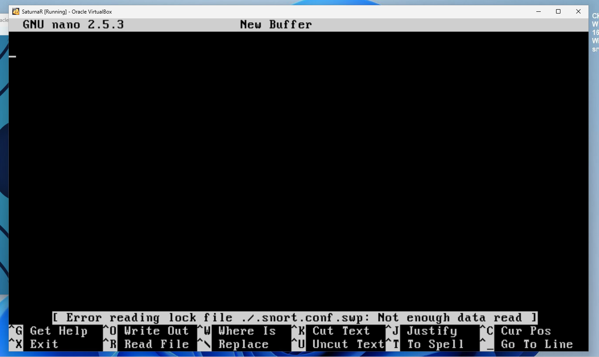
                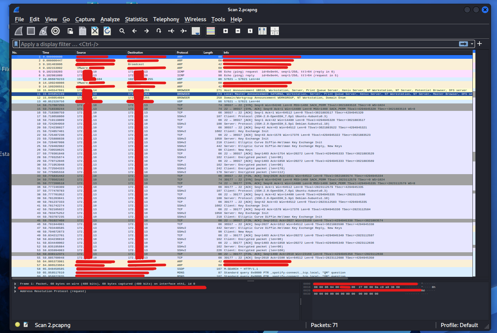
            

        </figure>
 
            

                As we can see from the packet capture, we can say that the execution of the OpenSSH username enumeration exploit generated a sequence of SSH-related packets between the attacking machine <strong>(172.XXX.XXX.10)</strong> and the target host <strong>(172.XXX.XXX.13)</strong>. 
            

            

                First, we notice that the communication begins with the standard <strong>TCP three-way handshake</strong>, followed by the SSH protocol version exchange <strong>(SSH-2.0-OpenSSH_7.6p1 Ubuntu)</strong>, key exchange initialization messages, and several encrypted packets. This indicates that the client successfully establishes an SSH session before attempting the username validation process. After the authentication attempt is completed, the connection is gracefully closed with <strong>FIN and ACK packets.</strong>
            

 
        <figure>
            

                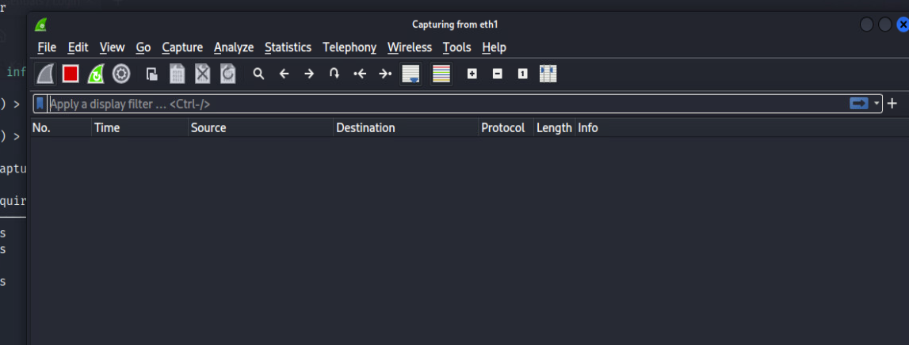
                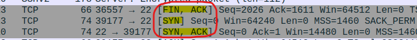
                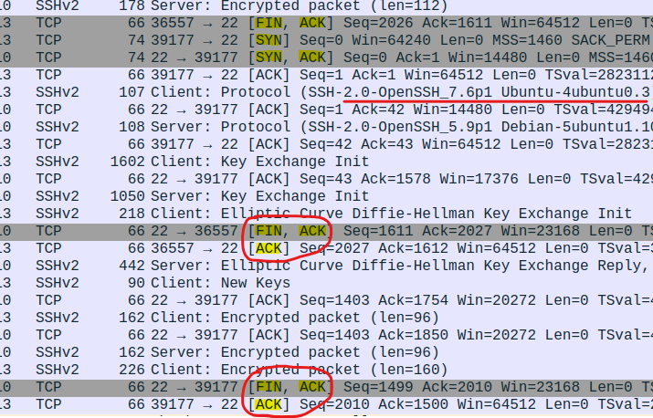
            

        </figure>
 
            

                We then observe a new <b>TCP handshake</b> and another <b>SSH session</b> being established, indicating that the enumeration tool opens separate connections for successive username validation attempts rather than reusing a single persistent connection.
            

            

                Furthermore, the capture includes multiple ACK packets, SSH key exchange messages <strong>(Key Exchange Init and New Keys)</strong>, and encrypted traffic exchanged in rapid succession. This pattern suggests that an automated tool is repeatedly establishing SSH sessions <strong>to test different usernames</strong> while appearing as legitimate SSH communication.
            

 
        <figure>
            

                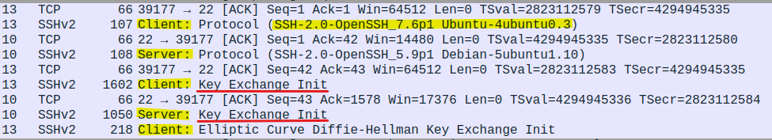
            

 
        </figure>
            

                At the end, <strong>Wireshark</strong> capture shows that the enumeration attack uses standard SSH communication rather than malformed packets. By repeatedly establishing valid SSH sessions and analyzing the server’s authentication behavior, the tool can infer whether a username exists on the target system.
            

        </section>
<!---------------------------------------------------------------------------->
        <section>
            <h1 align="center">PART 3 - Configurating Snort Rules</h1>
            

                To defend against this scenario, Snort was configured to monitor network traffic and generate alerts when suspicious SSH activity is detected. In addition, iptables rules were implemented to restrict unauthorized access attempts and reduce the attack surface exposed by the SSH service.  Before using it, we first had to configure it properly. As part of the setup process, we created a directory to store Snort alert logs using the following path and commands:
            

 
        <figure>
            

                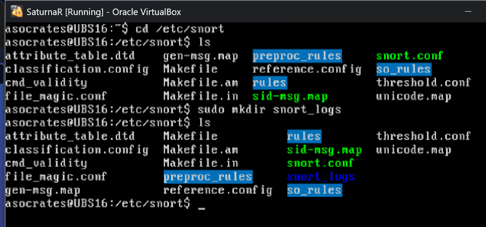
            

        </figure>
 
            

                After creating the alert directory with a path of /etc/snort/snort_logs. I edited Snort's main configuration file, `snort.conf`, to customize it for our network environment.
            

            <ul>
                <li><strong>In Step #1:</strong> I configured the "HOME_NET" variable by specifying the IP address range of our protected network using CIDR notation with a /24 subnet mask. This allowed Snort to identify which hosts belonged to the internal network being monitored.</li>
 
                <li><strong>In Step #7:</strong> I enabled local rules by removing the comment symbol ("#") from the `local.rules` include statement. This allowed Snort to load and apply the custom detection rules that I created to help defend the network against potential attacks</li>
            </ul>
 
        <figure>
            

                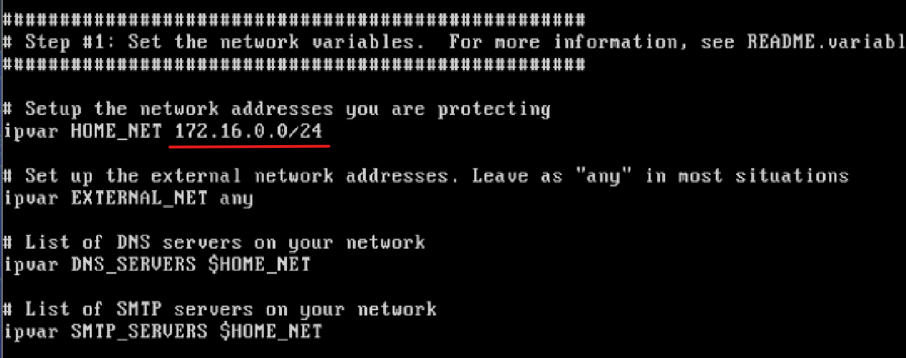
                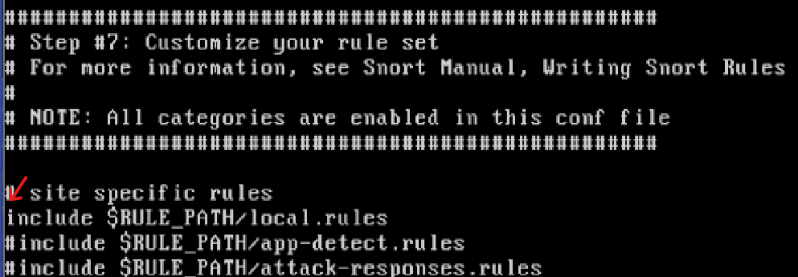
            

        </figure>
 
            

                Now, the following Snort rules were designed to monitor <strong>SSH traffic</strong> and <strong>identify behavior</strong> consistent with automated username enumeration attacks. They detect the SSH protocol banner exchange and generate alerts when a single source initiates multiple SSH connections within a short period of time, which may indicate repeated authentication attempts by exploits tools such as <strong>Metasploit.</strong>
            

 
        <figure>
            

                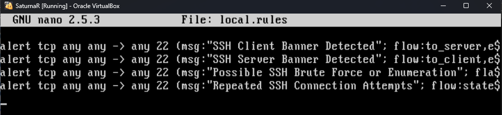
            

        </figure>
 
        </section>
<!---------------------------------------------------------------------------->
        <section>
            <h1 align="center">PART 4 - Intrusion Detection Mode</h1>
            

                Snort was deployed on SaturnaR to monitor the network traffic between <strong>the attacker machine (Kali Linux)</strong> and <strong>the target host (SaturnaN)</strong>. Once the SSH username enumeration attack was performed against 172.XXX.XXX.13, Snort detected the resulting SSH communication and generated alerts. The screenshot shows alerts related to the SSH client and OpenSSH banners, indicating that the custom rules worked as intended. These results demonstrate that Snort can successfully detect and report SSH activity generated during a username enumeration attack.
            

 
        <figure>
            

                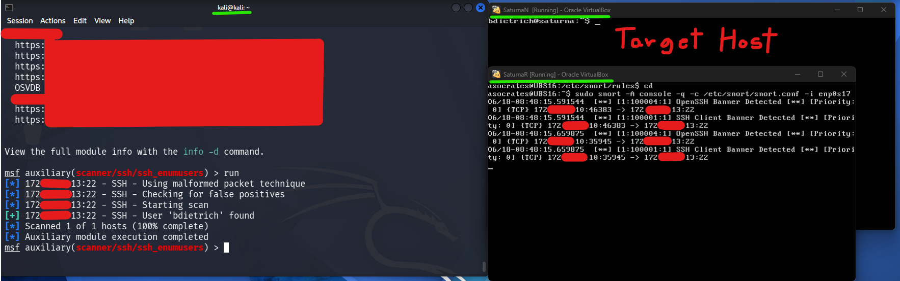
            

        </figure>
 
            

            

                <strong>Before</strong> running the exploit:
            

        <figure>
                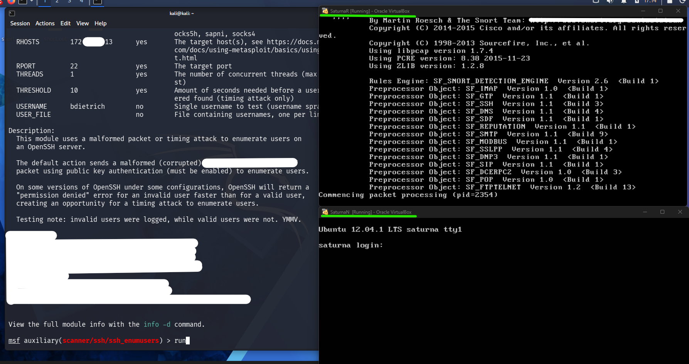
        </figure>
 
 
            

                <strong>After</strong> running the exploit:
            

        <figure>
            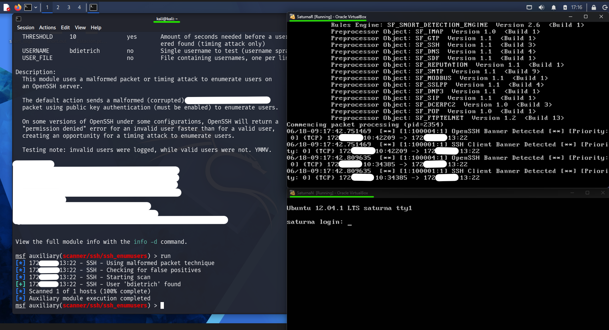
            

        </figure>
 
            

                Snort stores its alerts locally on the monitoring machine. To review them more conveniently, we accessed the log files from our Kali Linux system using <strong>SFTP (Secure File Transfer Protocol)</strong>, an application-layer protocol that securely transfers files over SSH. Unlike traditional FTP, SFTP encrypts both authentication and data transfers. This allowed us to safely retrieve and analyze the Snort alerts in a more user-friendly way.
            

 
        <figure>
            

                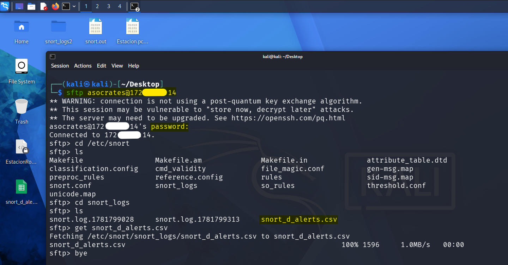
                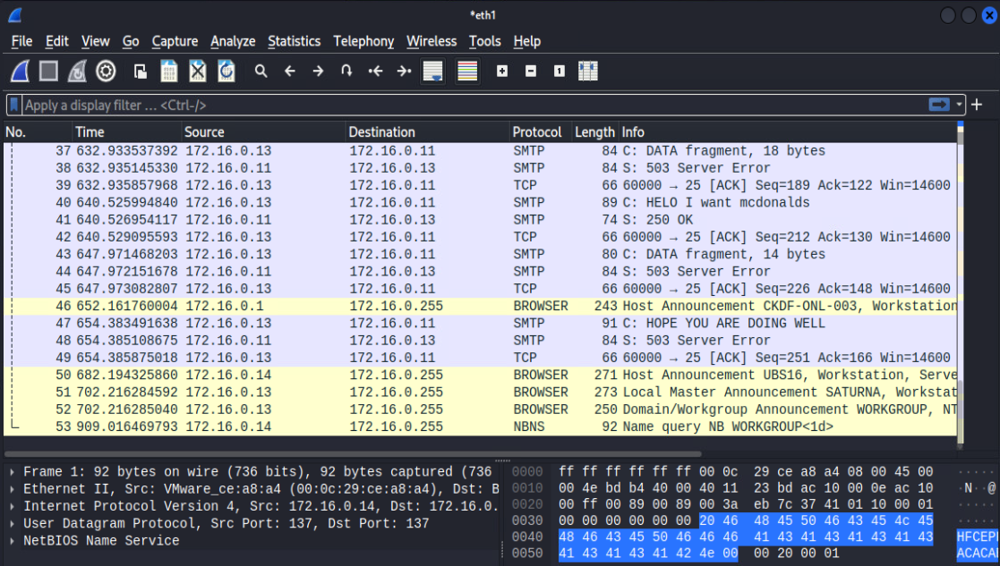
            

        </figure>
 
            

                Another convenient way to retrieve the Snort logs from the monitoring machine is by using <strong>FileZilla</strong>, a graphical user interface <b>(GUI)</b> application that supports both <b>FTP (File Transfer Protocol)</b> and <b>SFTP (Secure File Transfer Protocol)</b>. These are application-layer protocols used for file transfers over a network. In our case, we used SFTP because it operates over SSH and encrypts both the authentication process and the transferred data, providing a secure and user-friendly method for accessing the Snort log files.
            

 
        <figure>
            

                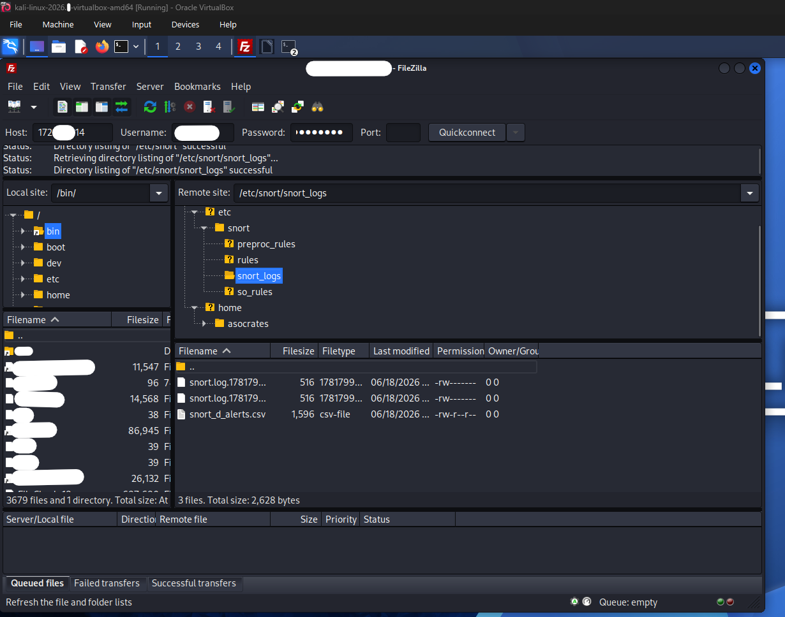
            

        </figure>
 
        </section>
<!---------------------------------------------------------------------------->
        <section>
            <h1 align="center">PART 5 - IPTables (or Firewall)</h1>
            

                To mitigate the SSH username enumeration attack, IPTables (firewall) rules were configured to restrict repeated connection attempts to the SSH service. For this demonstration, the rules were implemented on the Kali machine solely for testing purposes and to illustrate how such filtering could mitigate the attack. In a real-world environment, these rules would typically be deployed on the target host itself or on a dedicated firewall or gateway device positioned in front of the target system, where they can block malicious traffic before it reaches the SSH service.
            

 
        <figure>
            

                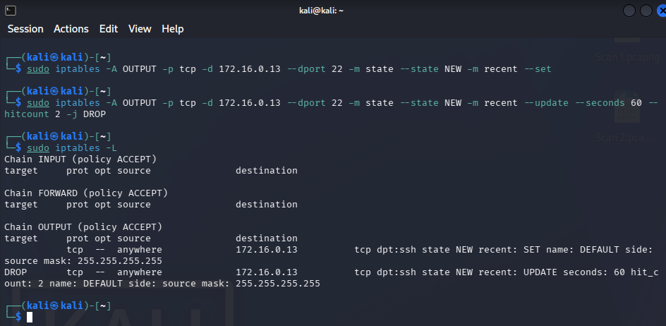
            

        </figure>
 
            

                Next, we executed the SSH exploit once again after applying the IPTables rules. As shown in the results, the attack was no longer able to proceed successfully and failed to identify a valid username, demonstrating that the firewall effectively restricted the repeated SSH connection attempts required by the enumeration process. Combined with the Snort alerts generated during the activity, these defensive measures illustrate how layered security controls can detect and mitigate automated SSH reconnaissance attacks. 
            

 
        <figure>
            

                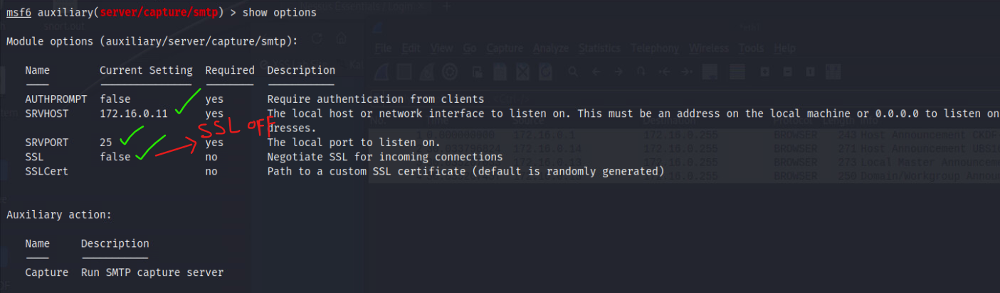
            

        </figure>
 
            

                In addition to Snort and IPTables, the most effective long-term defense is to update OpenSSH to a version that fixes CVE-XXX-XXXX. Additional protections include using SSH key-based authentication instead of passwords, implementing tools such as Fail2Ban to automatically block repeated login attempts, restricting SSH access to trusted IP addresses, enabling multi-factor authentication, and maintaining regular security updates and log monitoring. Together, these measures will reduce the risk of SSH enumeration exploits and unauthorized access.
            

            

                👾 Thanks for reading! Keep your systems updated, your passwords strong, and your coffee stronger. ☕🔒 
            

        </section>
    </body>
</html>

