<!DOCTYPE html>

<html>
<head>
    <title>The Report</title>
    <h1 align="center">The Report</h1>
</head>
<!---------------------------------------------------------------------------->
    <body>
        <section>
            <h1 align="center">Reconnaissance</h1>
            

                First, I examined the network interfaces with root privileges using Linux commands. I identified that my local network IP address is 
                <strong>192.xxx.xxx.11</strong> 
                (eth0), while the IP address connected to the subnet lab network is 
                <strong>172.xxx.xxx.11</strong> 
                (eth1). The second interface corresponds to the network where the target machines are located. From the attacking machine, I performed a basic host discovery scan using <strong>Zenmap GUI</strong> within the range  
                <strong>172.xxx.xxx.0-20</strong> 
                to identify active hosts in this network.
            

        <figure>
            

            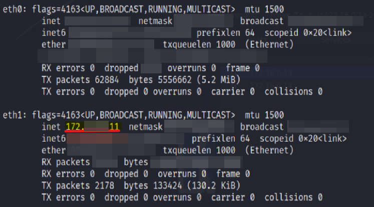
            

        </figure>
        </section>
<!---------------------------------------------------------------------------->
        <section>
            <h1 align="center">Scanning</h1>
            <h3 align="center">Vulnerability Assesment + Port Scanning</h3>
            

                When given a range of
                <strong>IP addresses</strong>
                , the scanner probes each address by sending packets (such as 
                <strong>ARP requests</strong> or 
                <strong>ICMP echo requests</strong>) 
                to determine whether a host is active. If a host responds, it is marked as “up”; otherwise, it is considered down or not included in the results.
            

        <figure>
            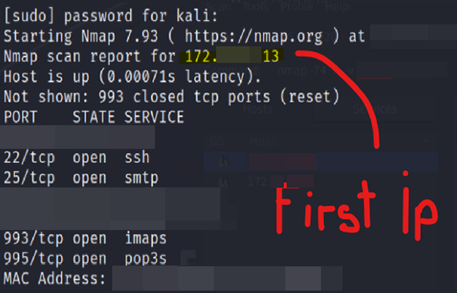
            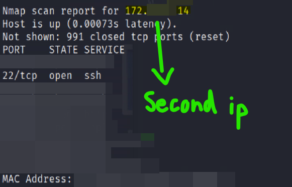
        </figure>
        </section>
<!---------------------------------------------------------------------------->
        <section>
            

                This scan revealed two active hosts with IP addresses 
                <strong>172.xxx.xxx.13</strong> and 
                <strong>172.xxx.xxx.14</strong>
                , which correspond to the 
                <strong>SaturnaN</strong> and 
                <strong>SaturnaR</strong> 
                target systems. The resulting <b><em>network topology</em></b> is illustrated below.
            

        <figure>
            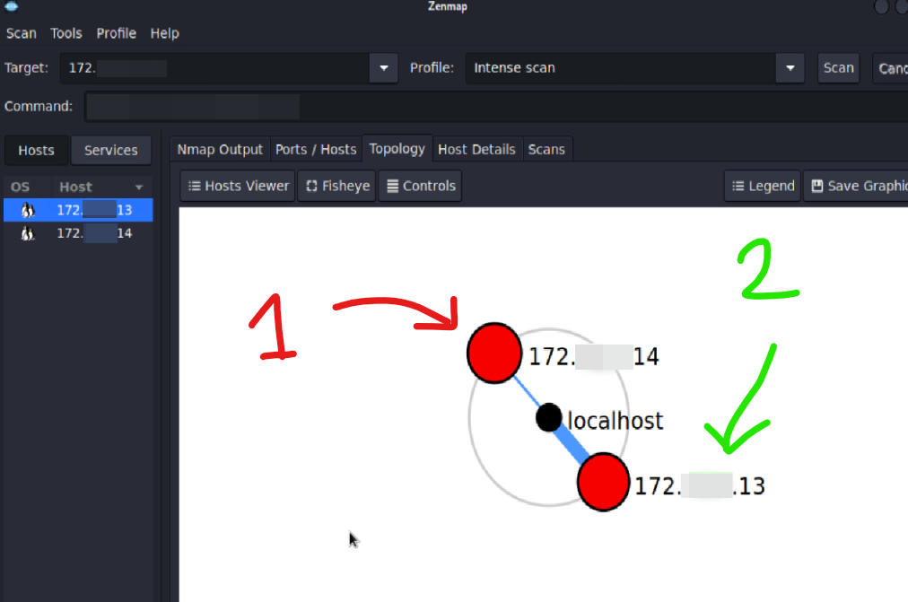
        </figure>
        </section>
<!---------------------------------------------------------------------------->
        <section>
            

                One way to distinguish between the machines was by analyzing the services exposed on each system/host. here I used 
                <strong>Nessus scan</strong> 
                to enumerated services such as 
                <strong>FTP, SSH,</strong> and 
                <strong>HTTP</strong>
                and identified their versions. 
            

        <figure>
            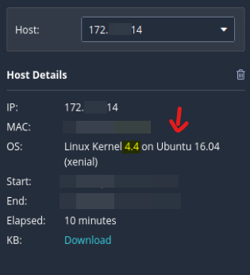
            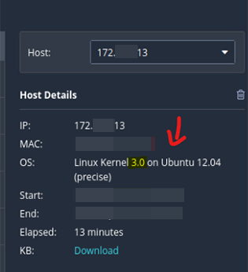
        </figure>
            
 
                Based on this scan results, 
                <strong>172.xxx.xxx.13</strong>
                was identified as 
                <strong>SaturnaN</strong> because it exposed vulnerable and outdated services such as FTP and SSH, on its OS. In contrast,
                <strong>172.xxx.xxx.14</strong>
                appeared to be more secure, running more updated Operating System with fewer exploitable services exposed, which identified it as 
                <strong>SaturnaR</strong>. 
            

        <section>
            

                At this point, I also used Nmap to enumerate 
                <strong>open ports</strong> 
                and identify 
                <strong>service versions</strong>
                , while Nessus was used to perform 
                <strong>vulnerability scanning</strong> and 
                <strong>gather additional information</strong> 
                about outdated services and the operating system. The usage of both tools provided me a more complete understanding of each host’s exposure and potential vulnerabilities for later assessment.  
            

        <figure>
                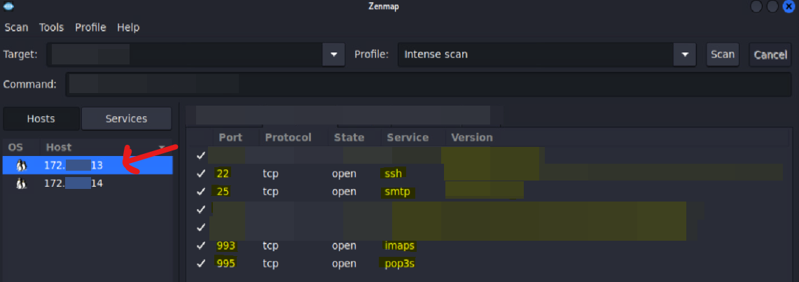
                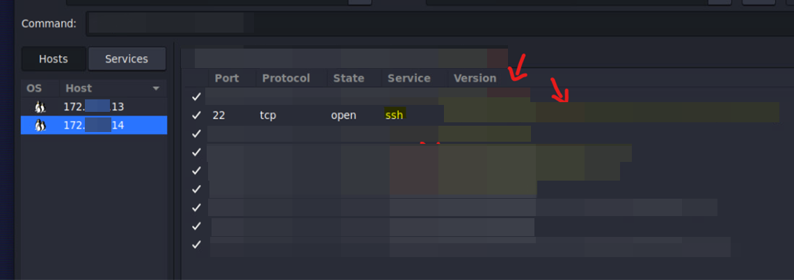
        </figure>
        </section>
<!---------------------------------------------------------------------------->
        <section>
            

                In the following section, I will further explain why I selected these upcoming services from these VMs that I considered highly vulnerable, as they increase the chances of successfully carrying out a more effective exploit. 
            

        <figure>
            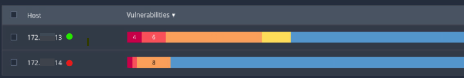 
        </figure>
        </section>
<!---------------------------------------------------------------------------->
        <section>
            <h4><strong>1. CRITICAL: 172.xxx.xxx.13 - SaturnaN</strong></h4> 
            <ul>
                <li><b>Port:</b> #22</li>
                <li><b>Service:</b> SSH</li>
                <li><b>Problem:</b> Version of OS</li>
            </ul>
            

                For this first vulnerability I selected, the service running on port #22 SSH is hosted on a system using Ubuntu 12.04.x OS distro from linux. It is no longer supported by Canonical since 2017, it does not receive security updates or patches. This increases the risk that known vulnerabilities affecting core system components remain unpatched and exploitable by attackers. As a result, this could potentially allow unauthorized access, privilege escalation, or remote code execution. The recommended solution is to upgrade the system to a currently supported version of Ubuntu.
            

         
            <h4><strong>2. CRITICAL: 172.xxx.xxx.13 - SaturnaN</strong></h4>
            <ul>
                <li><b>Port:</b> #25, #993 and #995</li>
                <li><b>Services:</b> SMTP, IMAP and POP3</li>
                <li><b>Problem:</b> SSL/TLS</li>
            </ul>
            

                In this case, the issue appears to be that the system is using outdated encryption protocols such as SSL 2.0 or SSL 3.0. These legacy versions contain numerous security weaknesses and cryptographic flaws, including insecure padding schemes in CBC ciphers and vulnerabilities in session renegotiation. Such weaknesses can be exploited by attackers to perform Man-in-the-Middle (MITM) attacks, allowing them to intercept, manipulate, or decrypt communications between affected services. Because these protocols are no longer considered secure, they have been replaced by Transport Layer Security (TLS), which provides stronger encryption, improved authentication mechanisms, and protection against known cryptographic attacks.
            

         
            <h4><strong>3. CRITICAL: 172.xxx.xxx.14 - SaturnaR</strong></h4>
            <ul>
                <li><b>Port:</b> #22</li>
                <li><b>Service:</b> SSH</li>
                <li><b>Problem:</b> OpenSSH </li>
            </ul>
            

                This version of Ubuntu, developed by Canonical, is no longer under maintenance, meaning it no longer receives security patches or software updates. As of today, this lack of support significantly increases the system’s exposure to known vulnerabilities and unpatched exploits. The recommended course of action is to upgrade to a newer, actively supported Ubuntu release—preferably a current LTS (Long Term Support) version—that receives regular security updates and ongoing maintenance to ensure system stability and protection.
            
        
        </section>
<!---------------------------------------------------------------------------->
        <section>
            <h1 align="center">Exploitation</h1>
            

                In this part of the project, I used three password-cracking tools<strong>—Ncrack, Medusa, <strong>and</strong> Hydra—</strong>against the SaturnaN host. But, before to do so I noticed there was unwanted “junk” content in the directory, which can cause a delay password testing so I cleaned it directly through the console.
            

            <ul>
                <li><strong>grep</strong> -v "comment" /home/kali/Desktop/xxx.pwd > clean.txt </li>
                <li><strong>mv</strong> clean.txt /home/kali/Desktop/xxx.pwd</li>
            </ul>
        <figure>
            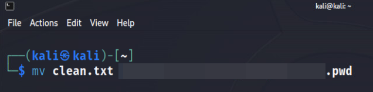
        </figure>
            

                Once we had our file cleaned I started using our cracking tools where I tested access using a sample account associated with Ms. Beate Dietrich, leveraging common <strong>credential and username conventions</strong> (e.g., jdoe/password) to streamline authentication testing.
            

            <ul>
                <li><strong>ncrack</strong> --user bdietrich -P /home/kali/Desktop/xxx.pwd ssh://172.xxx.xxx.13</li>
                <li><strong>medusa</strong> -u bdietrich -P /home/kali/Desktop/xxx.pwd -h 172.xxx.xxx.13 -M ssh -t 10</li>
            </ul>
        <figure>
            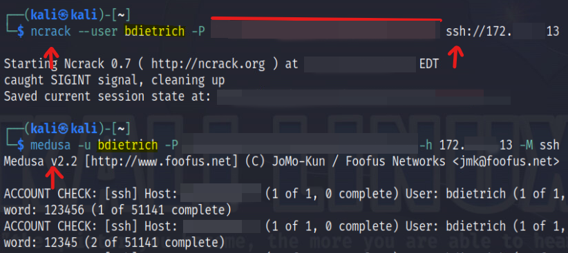
        </figure>
            <ul>
                <li><strong>hydra</strong> -l bdietrich -P /home/kali/Desktop/xxx.pwd 172.xxx.xxx.13 ssh -t 10</li>
            </ul>
        <figure>
            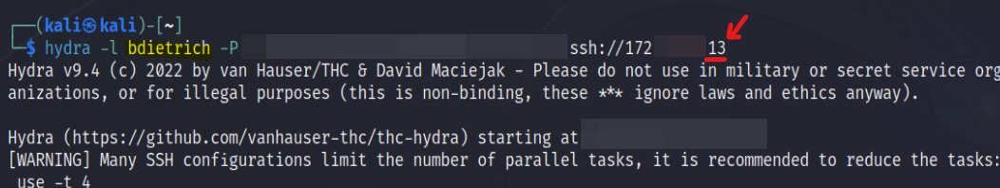
        </figure>
            

                All <strong>three tools</strong> successfully identified the credentials but showed different performance. <b>Ncrack</b> delayed its output, likely to prioritize efficiency, while <b>Medusa</b> and <b>Hydra</b> provided <strong>real-time progress updates</strong>. After increasing parallel attempts with <b>`-t 4`</b>, all tools reached the same result, though Hydra stood out for its faster simultaneous attempts and clearer output. The credentials for `bdietrich` were successfully identified as `xxx`.
            

        <figure>
            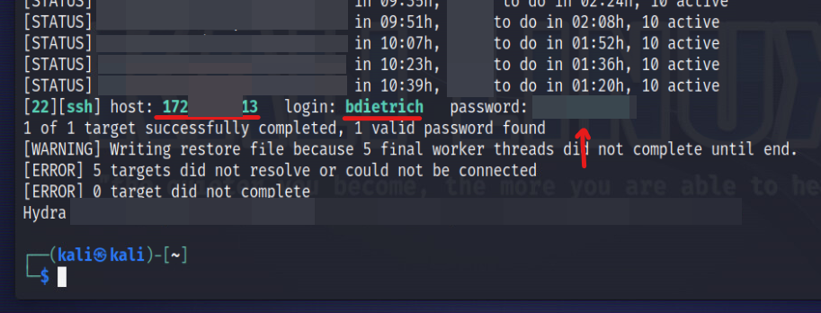
        </figure>
        </section>
<!---------------------------------------------------------------------------->
        <section>
            <h1 align="center">Post-Exploitation</h1>
            

                Once the password is known, I was able to remotely access the target machine through my attacker machine using the following command line.
            

            
<b>ssh bdietrich@172.xxx.xxx.13</b>
            

            

                This command uses <b>SSH</b> to connect to the remote system, where bdietrich is <strong>the username</strong> and 172.xxx.xxx.13 is <strong>the target IP address</strong>. You may be prompted to confirm the connection—type “yes”—and then enter the password: xxx.
            

            

                After gaining access, I used the <strong>`ls -la`</strong> command to examine the system’s directories and files. This command lists all files, including <strong>hidden files</strong>, in a detailed format displaying permissions, link counts, ownership details, file sizes, modification dates, and file names. The main objective of this <strong>educational project</strong> stage was to access the private network, identify sensitive company data, and retrieve fictional account credentials and financial information stored within the target files.
            

        <figure>
            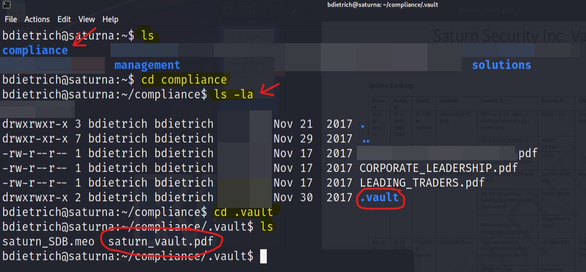
        </figure>
            

                To securely download and inspect the target file, I used the <strong>scp</strong> command, which enables encrypted file transfers between remote systems over SSH. This allowed me to retrieve the file from the remote host for further analysis within the lab environment.
            

        <figure>
            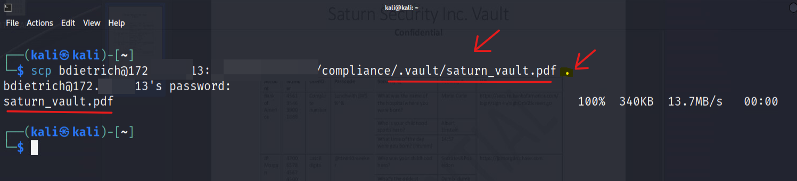
            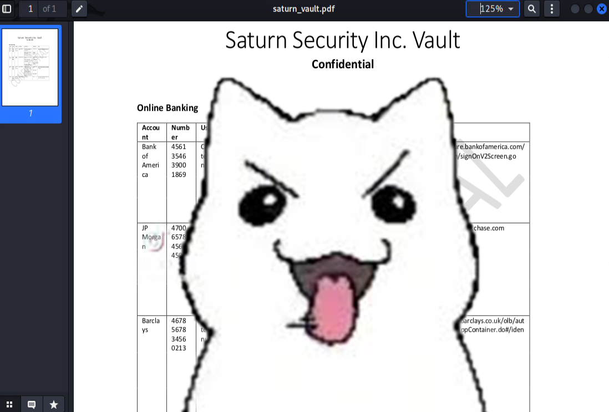
        </figure>
        </section>

</body>
</html>

